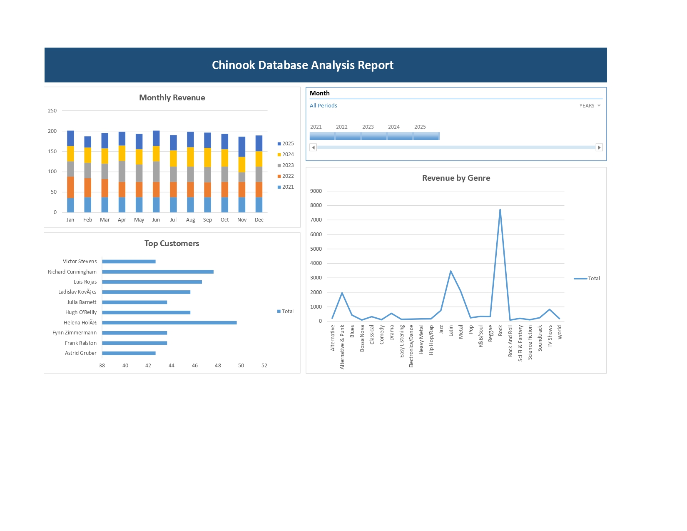

# chinook SQL & Excel data analysis project

## Project overview
This project analyzes the chinook sample database, which is basically a digital music store. 
The objective is to explore the database structure, validate data quality, perform sales and customer analysis, and generate outputs that are ready for research and decision making.

## Dataset
- chinook Sample Database (MySQL)
- Source: https://github.com/lerocha/chinook-database/releases   (filename: "Chinook_MySql.sql)

## Tools
- MySQL Workbench
- SQL
- Microsoft Excel

## Analyses
1. `Database overview & relationships`
   - Explored tables and verified key relationships between customers, invoices, tracks, albums, and artists.

2. `Data quality checks`
   - Verified that all customers have invoices.
   - Identified tracks that were never sold.
   - Confirmed all invoice totals are positive.

3. `Sales & customer analysis`
   - Analyzed revenue per customer and per country.
   - Identified top-performing artists and genres.
   - Evaluated product demand using sales quantities.

4. `Reporting & visualization`
   - Created SQL queries.
   - Exported results to Excel.
   - Built charts to visualize trends and rankings.

## Notable insights
- Revenue follows clear monthly trends over time.
- All customers contribute significant shares in revenue.
- Rock genre extremely outperforms other genres in revenue.
- Several tracks have never been sold, maybe due to low demand.

